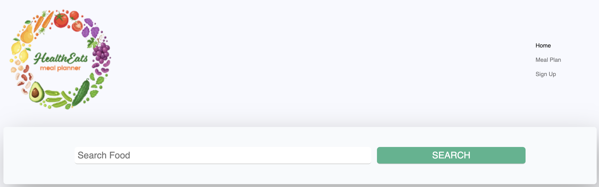

# HealthEat
### The healthy meal plan app

https://peaceful-thicket-73252.herokuapp.com/

## About

Have you ever wanted to cook dinner, but weren't sure what to make? This is a full-stack MERN application intended to help people to plan healthy meals. Users can choose their dietary restrictions and the number of recipes desired.

## Development

This application was developed using React, Bootstrap, and Material-UI on the front end. User data is stored in a Mongo database managed by Mongoose. 

## Future Development

We would like to add user profiles to the application. We envision this as a way for users to save their favorite recipes and dietary preferences. In addition, we would like users to be able to plan meals for weeks at a time, then have a grocery list automatically generated based on ingredient lists from each recipe. 